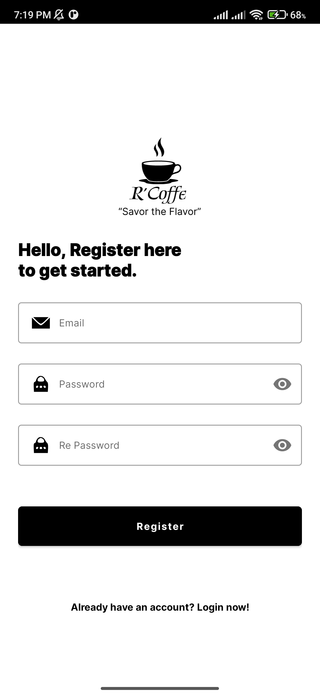
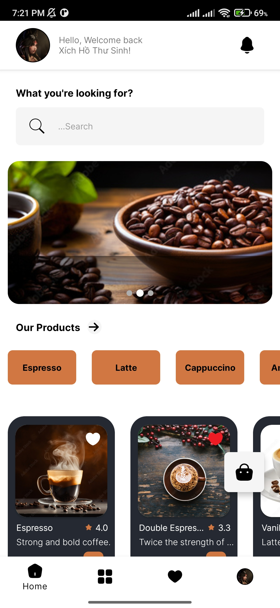
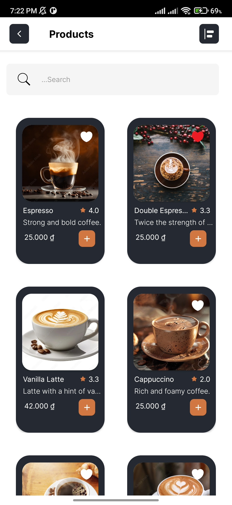
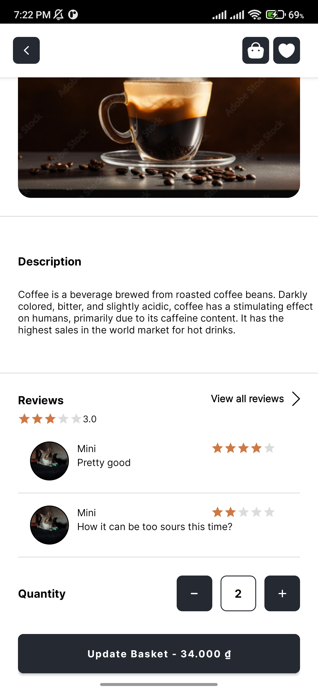
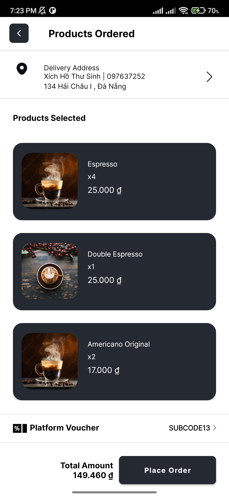
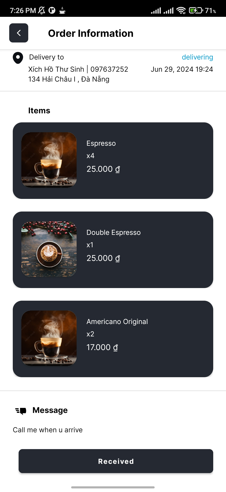
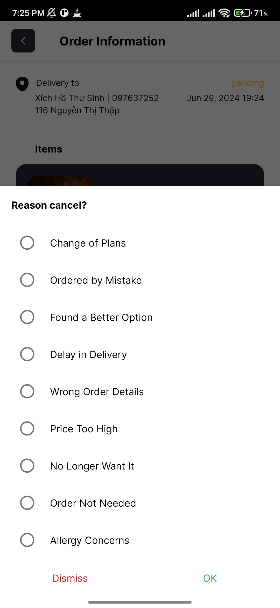
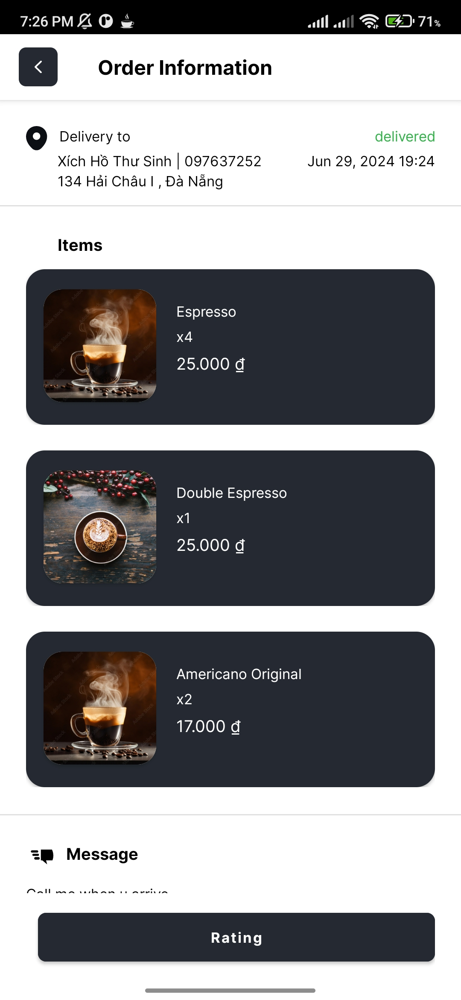
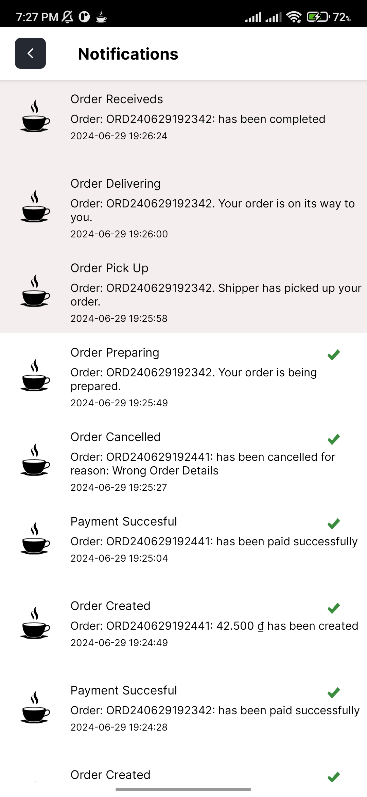
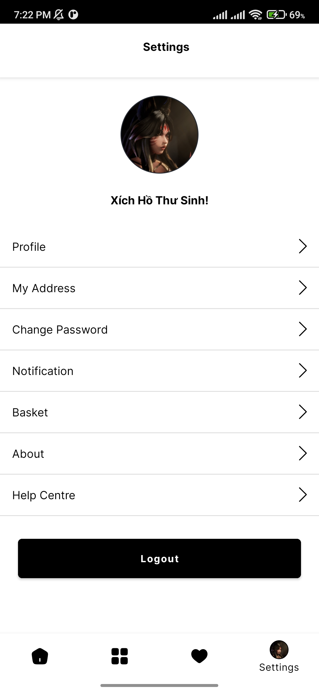

# R-Coffee App

## Overview

R-Coffee app is a frontend application that follows the Model-View-ViewModel (MVVM) architecture. The app is built primarily using Kotlin, with some Java components to make payment functionality. It aims to provide a seamless and efficient user experience for managing coffee-related tasks. Read more about [Backend](https://github.com/SUMMER24-R-Coffee/R-Coffee_Server). UI design [Figma](https://www.figma.com/design/BmEKc2HmaQ0NbgAF/R'Coffee-UI?node-id=11-2&t=Jpe6wlVOrtKx7zzz-0).

<!--## Features

- **MVVM Architecture**: Ensures a clear separation of concerns and facilitates easier testing and maintenance.
- **Kotlin and Java**: Leverages the strengths of both languages.
- **Responsive UI**: Designed to provide a smooth user experience across different devices.-->

## Installation

### Prerequisites

- [Java Development Kit (JDK) 11+](https://www.oracle.com/java/technologies/javase-jdk11-downloads.html)
- [Android Studio](https://developer.android.com/studio)

### Steps

1. Clone the repository:
   ```sh
   git clone https://github.com/SUMMER24-R-Coffee/R-Coffee_App.git

2. Open the project in Android Studio.
3. Sync the project with Gradle files.
4. Run the application on an emulator or a connected device.
### Usage
You need to install the [Backend](https://github.com/SUMMER24-R-Coffee/R-Coffee_Server) first. Then, run the backend and the MySQL database using XAMPP or Workbench before installing the app. After running the app, you can start managing your coffee-related tasks. The app provides an intuitive UI to help you get started quickly. 

### Screen shot
| | |
|---|---|
|  |  |
| **Login** | **Register** |
|  |  |
| **Verrification** | **Home Screen For Client** |
|  |  |
| **Home Screen For User** | **Products** |
|  |  |
| **Product Information** | **Product Information** |
|  |  |
| **Basket** | **Order** |
|  |  |
| **Order** | **Order Detail** |
|  |  |
| **Order Information** | **Cancel Order** |
|  |  |
| **Order Information** | **Order History** |
|  |  |
| **Order History** | **Order History** |
|  |  |
| **Rating** | **Notification** 
|  |  |
| **Notification** | **Account** |
|  |  |
| **Settings User** | **Settings Client** |

 **Note**: this application will be further improved in the future.
